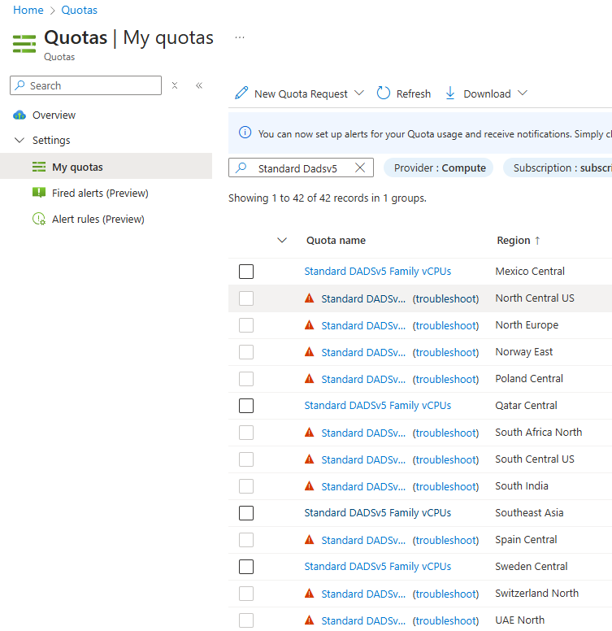

# 利用制限の確認

以降の作業を進めるにあたり、先回りして Azure サービス利用に関する制限の有無を確認します。

- Azure ではサービスの利用に関して、リージョンや SKU による制限が設けられていることがあります。特に無償サブスクリプションや MSDN サブスクリプションなどでは制限がかかっていることも多く、以降の作業を進める前に確認を取っておいた方が無難です。
- VM であれば az vm list-skus コマンド、SQL DB であれば az sql db list-editions コマンドを利用して確認します。Restrictions, Available の列をチェックし、制限が出ている場合や Available = False の場合は別リージョンを探してみてください。
- 実際にはさらに AZ 制約、クォータ制約などもあるため、利用するサービスに応じて確認を取ってください。

制限がある場合の出力例は以下の通りです。

```bash
ResourceType     Locations    Name               Zones    Restrictions
---------------  -----------  -----------------  -------  ----------------------------------------------------------------------------------------------------------------------------------------------
virtualMachines  eastus       Standard_D2ads_v5  1,2,3    ['NotAvailableForSubscription, type: Location, locations: eastus', 'NotAvailableForSubscription, type: Zone, locations: eastus, zones: 1,2,3']

ServiceObjective    Sku    Edition    Family    Capacity    Unit    Available
------------------  -----  ---------  --------  ----------  ------  -----------
Basic               Basic  Basic                5           DTU     False
```

制限がない場合の出力例は以下の通りです。

```bash
ResourceType     Locations    Name               Zones    Restrictions
---------------  -----------  -----------------  -------  --------------
virtualMachines  westus       Standard_D2ads_v5           None

ServiceObjective    Sku    Edition    Family    Capacity    Unit    Available
------------------  -----  ---------  --------  ----------  ------  -----------
Basic               Basic  Basic                5           DTU     True
```

以下のスクリプトで確認してください。

``` bash

# すべての SKU を確認したい場合は以下
# az vm list-skus --location ${TEMP_LOCATION_NAME} --size Standard_ --all --output table
# az sql db list-editions --location ${TEMP_LOCATION_NAME} --output table

# v5 シリーズ以降を利用（WSL2/Docker を利用するため）
DEFAULT_VM_SIZE="Standard_D2ads_v5"

for i in "0" "1"; do
TEMP_LOCATION_NAME=${LOCATION_NAMES[$i]}
TEMP_LOCATION_PREFIX=${LOCATION_PREFIXS[$i]}

echo "${TEMP_LOCATION_NAME} における VM 利用制限の有無"
az vm list-skus --location ${TEMP_LOCATION_NAME} --size ${DEFAULT_VM_SIZE} --all --output table
echo "${TEMP_LOCATION_NAME} における SQL DB 利用制限の有無"
az sql db list-editions --location ${TEMP_LOCATION_NAME} --output table --subscription ${SUBSCRIPTION_ID_MGMT} --edition "Basic"

done #i

```

## 特定の VM サイズでの利用制限の確認

特に制限の強いサブスクリプションを利用しており、利用可能なリージョンが少ない場合には、クォータ画面を使って探した方が早い場合があります。下図のようにフィルタリングをかけて探してみるとよいでしょう。

  

## 他のリージョンペアのパターン

- リージョン一覧は az account list-locations --output table コマンドで取得します。
- 主要なペアリージョン一覧が必要な場合は以下のコマンドで取得します。

```bash

az account list-locations --query "[?metadata.regionType == 'Physical' && metadata.regionCategory == 'Recommended'].{RegionDisplayName:displayName, RegionName:name, PairedRegion:metadata.pairedRegion[0].name}" --output table

```

### 日本リージョンペア

```bash

LOCATION_NAMES[0]=japaneast
LOCATION_NAMES[1]=japanwest
LOCATION_PREFIXS[0]=jpe
LOCATION_PREFIXS[1]=jpw

```

### アジアペア

```bash

LOCATION_NAMES[0]=southeastasia
LOCATION_NAMES[1]=eastasia
LOCATION_PREFIXS[0]=sea
LOCATION_PREFIXS[1]=eas

```

### 米国南中部ペア

```bash

LOCATION_NAMES[0]=southcentralus
LOCATION_NAMES[1]=northcentralus
LOCATION_PREFIXS[0]=scu
LOCATION_PREFIXS[1]=ncu

```

### 米国中部ペア

```bash

LOCATION_NAMES[0]=centralus
LOCATION_NAMES[1]=eastus2
LOCATION_PREFIXS[0]=cus
LOCATION_PREFIXS[1]=eus2

```

### 米国西部ペア

```bash

LOCATION_NAMES[0]=westus2
LOCATION_NAMES[1]=westcentralus
LOCATION_PREFIXS[0]=wus2
LOCATION_PREFIXS[1]=wcu

```

### 米国東部ペア

```bash

LOCATION_NAMES[0]=eastus
LOCATION_NAMES[1]=westus
LOCATION_PREFIXS[0]=eus
LOCATION_PREFIXS[1]=wus

```

### 米国西部3ペア

```bash

LOCATION_NAMES[0]=westus3
LOCATION_NAMES[1]=eastus
LOCATION_PREFIXS[0]=wus3
LOCATION_PREFIXS[1]=eus

```

### オーストラリアペア

```bash

LOCATION_NAMES[0]=australiaeast
LOCATION_NAMES[1]=australiasoutheast
LOCATION_PREFIXS[0]=aue
LOCATION_PREFIXS[1]=ause

```

### ヨーロッパペア

```bash

LOCATION_NAMES[0]=northeurope
LOCATION_NAMES[1]=westeurope
LOCATION_PREFIXS[0]=neu
LOCATION_PREFIXS[1]=weu

```

### スウェーデンペア

```bash

LOCATION_NAMES[0]=swedencentral
LOCATION_NAMES[1]=swedensouth
LOCATION_PREFIXS[0]=swc
LOCATION_PREFIXS[1]=sws

```

### イギリスペア

```bash

LOCATION_NAMES[0]=uksouth
LOCATION_NAMES[1]=ukwest
LOCATION_PREFIXS[0]=uks
LOCATION_PREFIXS[1]=ukw

```

### 西ヨーロッパペア

```bash

LOCATION_NAMES[0]=westeurope
LOCATION_NAMES[1]=northeurope
LOCATION_PREFIXS[0]=weu
LOCATION_PREFIXS[1]=neu

```

### 南アフリカ北ペア

```bash

LOCATION_NAMES[0]=southafricanorth
LOCATION_NAMES[1]=southafricawest
LOCATION_PREFIXS[0]=san
LOCATION_PREFIXS[1]=saw

```

### 韓国中央ペア

```bash

LOCATION_NAMES[0]=koreacentral
LOCATION_NAMES[1]=koreasouth
LOCATION_PREFIXS[0]=krc
LOCATION_PREFIXS[1]=krs

```

### カナダペア

```bash

LOCATION_NAMES[0]=canadacentral
LOCATION_NAMES[1]=canadaeast
LOCATION_PREFIXS[0]=cnc
LOCATION_PREFIXS[1]=cne

```

## 適切なリージョンがなかなか見つからない場合

以下の方法で、全リージョンを一通り検索してみてください。

```bash

for TEMP_LOCATION_NAME in $(az account list-locations --query "[?metadata.regionType == 'Physical' && metadata.regionCategory == 'Recommended'].{RegionName:name}" --output tsv); do

echo "${TEMP_LOCATION_NAME} における VM 利用制限の有無"
az vm list-skus --location ${TEMP_LOCATION_NAME} --size ${DEFAULT_VM_SIZE} --all --output table
echo "${TEMP_LOCATION_NAME} における SQL DB 利用制限の有無"
az sql db list-editions --location ${TEMP_LOCATION_NAME} --output table --subscription ${SUBSCRIPTION_ID_MGMT} --edition "Basic"
echo ""

done

```
