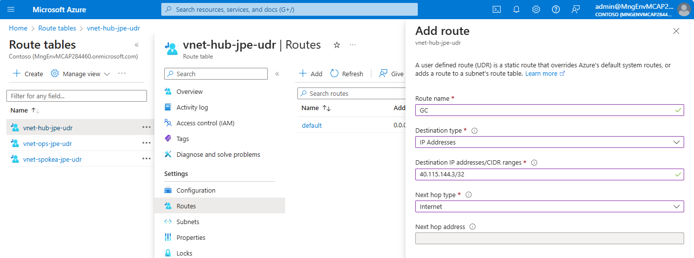

# ★ [Windows OS] CSB 適用

GC CSB を適用し、Windows OS をハードニングします。

- 既定で GC エージェントをセットアップした場合、CSB は MonitorOnly モードでインストールされます（＝チェックはするが是正はしない）。自動是正をするためには、ApplyAndMonitor モードでインストールする必要があります。
- すでに CSB ルールがインストールされている場合、設定のみを再変更することができないため、一度既存のルールを削除し、ApplyAndMonitor モードで再インストールする必要があります。これを行っているのが下記のスクリプトです。
- CSB ルール割り当てはサーバ側で行われるため、VM 側では即時にこれを検知できません（定期的なポーリングにより割り当てを再確認します）。急ぎで適用したい場合には、VM を再起動してください。再起動により GC エージェントがルール割り当てを確認してチェックを行います。
- CSB ルールによるハードニングは一発でうまくいかない場合があります。その場合には本スクリプトをもう一度実行してみてください。
- CSB によるハードニング処理とその結果報告には、少なくとも 10～30 分程度かかります。適用結果は Azure ポータルの "Guest Assginment" （ゲスト割り当て）のページから確認することができます。

※ 2024/07 時点では Guest Configuration エージェントに不具合があり、このままでは CSB がうまく動作しません。本ページの後半に Workaround がありますのでご確認ください。

```bash

for TEMP_SUBSCRIPTION_ID in $TEMP_TARGET_SUBSCRIPTION_IDS; do
echo "Setting GC CSB... ${TEMP_SUBSCRIPTION_ID}"
az account set -s "${TEMP_SUBSCRIPTION_ID}"
 
for i in ${VDC_NUMBERS}; do
  TEMP_LOCATION_NAME=${LOCATION_NAMES[$i]}
  TEMP_LOCATION_PREFIX=${LOCATION_PREFIXS[$i]}
 
for TEMP_RG_NAME in $(az group list --query "[?location == '${TEMP_LOCATION_NAME}' ].name" -o tsv); do
 
# Azure Windows Baseline の強制適用
for TEMP_VM_NAME in $(az vm list --resource-group ${TEMP_RG_NAME} --query "[?storageProfile.osDisk.osType=='Windows'].name" -o tsv); do
 
if [ -z "$(az vm extension list --vm-name "${TEMP_VM_NAME}" --resource-group ${TEMP_RG_NAME} --query "[?name=='AzurePolicyforWindows']" -o tsv)" ]; then
  echo "Installing AzurePolicyforWindows to ${TEMP_VM_NAME}..."
  az vm extension set --vm-name "${TEMP_VM_NAME}" --resource-group "${TEMP_RG_NAME}" --name "ConfigurationforWindows" --publisher "Microsoft.GuestConfiguration" --extension-instance-name "AzurePolicyforWindows" --enable-auto-upgrade false --no-auto-upgrade-minor-version true
fi
 
TEMP_GC_ASSIGNMENT_NAME="AzureWindowsBaseline"
TEMP_URI="/subscriptions/${TEMP_SUBSCRIPTION_ID}/resourceGroups/${TEMP_RG_NAME}/providers/Microsoft.Compute/virtualMachines/${TEMP_VM_NAME}/providers/Microsoft.GuestConfiguration/guestConfigurationAssignments/${TEMP_GC_ASSIGNMENT_NAME}?api-version=2022-01-25"

# 既存のものがある場合、一回消さないと割り当てられない
echo "Checking existing GC ${TEMP_GC_ASSIGNMENT_NAME} rule on ${TEMP_VM_NAME}"
TEMP=$(az rest --uri ${TEMP_URI} --method GET 2>&1)
if [[ ${TEMP} =~ "Not Found" ]]; then
echo "Not existing GC ${TEMP_GC_ASSIGNMENT_NAME} rule on ${TEMP_VM_NAME}"
else
echo "Deleting existing GC ${TEMP_GC_ASSIGNMENT_NAME} rule on ${TEMP_VM_NAME}"
az rest --uri ${TEMP_URI} --method DELETE
fi

# Resource Manager で割り当てる
cat <<EOF > tmp.json
{
  "\$schema": " https://schema.management.azure.com/schemas/2019-04-01/deploymentTemplate.json#",
  "contentVersion": "1.0.0.0",
  "resources": [
    {
      "apiVersion": "2022-01-25",
      "type": "Microsoft.Compute/virtualMachines/providers/guestConfigurationAssignments",
      "name": "${TEMP_VM_NAME}/Microsoft.GuestConfiguration/${TEMP_GC_ASSIGNMENT_NAME}",
      "location": "${TEMP_LOCATION_NAME}",
      "properties": {
        "guestConfiguration": {
          "name": "${TEMP_GC_ASSIGNMENT_NAME}",
          "version": "1.*",
          "assignmentType": "ApplyAndMonitor",
          "configurationParameter": [
          ],
          "configurationSetting": {
            "actionAfterReboot": "",
            "allowModuleOverwrite": false,
            "configurationMode": "ApplyAndMonitor",
            "configurationModeFrequencyMins": 15,
            "rebootIfNeeded": true,
            "refreshFrequencyMins": 5
          }
        }
      }
    }
  ]
}
EOF
echo "Creating GC ${TEMP_GC_ASSIGNMENT_NAME} rule on ${TEMP_VM_NAME}"
az deployment group create --name "${TEMP_VM_NAME}-${TEMP_GC_ASSIGNMENT_NAME}" --resource-group ${TEMP_RG_NAME} --template-file tmp.json
 
# 割り当たったことを確認
# az rest --uri ${TEMP_URI} --method GET
 
# VM を再起動
echo "Restarting ${TEMP_VM_NAME}"
az vm restart --force --resource-group ${TEMP_RG_NAME} --name ${TEMP_VM_NAME} --no-wait
 
done # TEMP_VM_NAME
done # TEMP_RG_NAME
done # TEMP_LOCATION_NAME
done # TEMP_SUBSCRIPTION_ID

```

## 2024/07 注記 Guest Configuration モジュールの不具合について

2024/07 時点では Guest Configuration モジュールの不具合により、Azure Firewall を経由した agentserviceapi.guestconfiguration.azure.com への通信がうまく通りません。結果として、下図のようにいつまで経っても状態が Pending から変更されません。

  

この不具合は今後修正予定ですが、直近では以下の手順により対応してください。

- vm-ops などのマシンに入り、nslookup agentserviceapi.guestconfiguration.azure.com を実行し、IP アドレスを確認（※ VM リージョンごとに解決される IP アドレスが異なるため、実機で確認してください。）
- VM が所属している Subnet に紐づけられた UDR に対してルートを追加し、得られた IP アドレスの Next Hop を Internet として設定してください。

```bash

C:\Users\azrefadmin>nslookup agentserviceapi.guestconfiguration.azure.com
Server:  UnKnown
Address:  168.63.129.16

Non-authoritative answer:
Name:    jpe-gas-cses-1b.japaneast.cloudapp.azure.com
Address:  40.115.144.3
Aliases:  agentserviceapi.guestconfiguration.azure.com
          agentserviceapi.privatelink.guestconfiguration.azure.com
          agentserviceapi.trafficmanager.net

```

  
