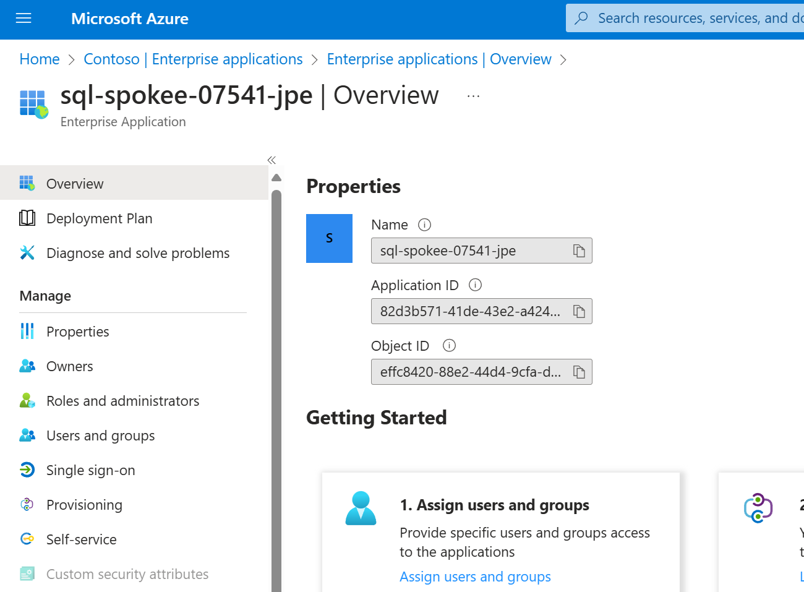
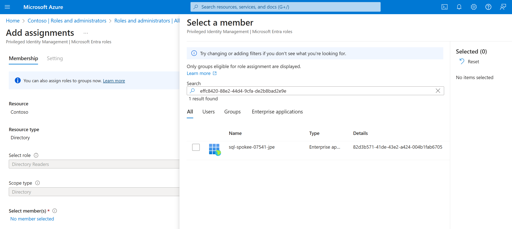
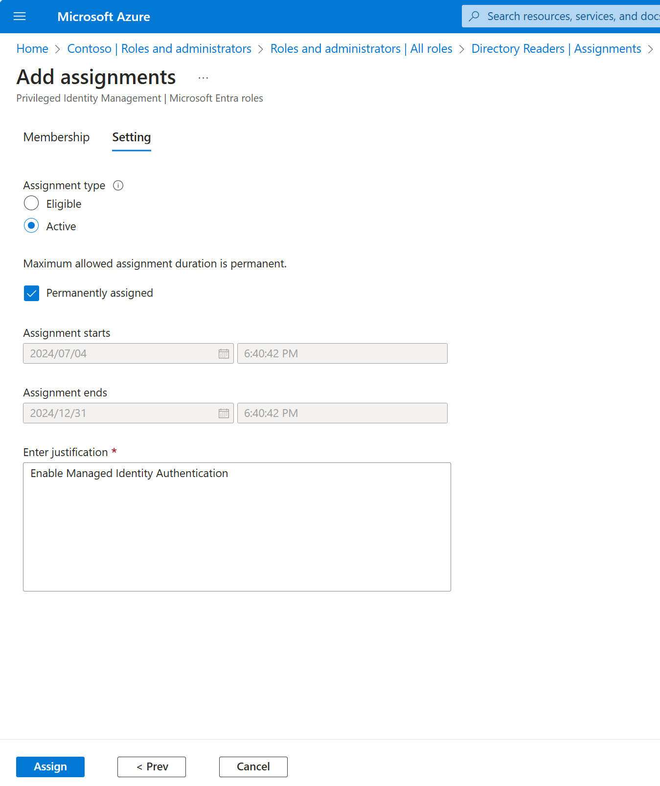

# SQL DB へのアクセス権限の付与

3 つの作業を実施

- Step 1. SQL 論理サーバで Entra ID 管理者を有効化
- Step 2. SQL 論理サーバの MID を有効化 + Directory Readers ロールを割り当て
- Step 3. Web App の MID に対してログイン権と db_datareader/datawriter ロールを割り当てる

## Step 1. SQL 論理サーバで Entra ID 管理者を有効化

- Managed ID によるアクセスを許可する (CREATE LOGIN 命令を実行する) ためには、まず SQL DB に対して Entra ID の管理者でアクセスする必要がある
- 運用管理 PC (vm-mtn-*) から SQL DB へ管理者としてアクセスできるようにする

```bash

# 業務システム E チーム／① 初期構築の作業アカウントに切り替え
if ${FLAG_USE_SOD}; then if ${FLAG_USE_SOD_SP}; then TEMP_SP_NAME="sp_spokee_dev"; az login --service-principal --username ${SP_APP_IDS[${TEMP_SP_NAME}]} --password '${SP_PWDS[${TEMP_SP_NAME}]}' --tenant ${PRIMARY_DOMAIN_NAME} --allow-no-subscriptions; else az account clear; az login -u "user_spokee_dev@${PRIMARY_DOMAIN_NAME}" -p "${ADMIN_PASSWORD}"; fi; fi
az account set -s "${SUBSCRIPTION_ID_SPOKE_E}"

for i in ${VDC_NUMBERS}; do
TEMP_LOCATION_NAME=${LOCATION_NAMES[$i]}
TEMP_LOCATION_PREFIX=${LOCATION_PREFIXS[$i]}
TEMP_RG_NAME="rg-spokee-${TEMP_LOCATION_PREFIX}"
TEMP_SQL_SERVER_NAME="sql-spokee-${UNIQUE_SUFFIX}-${TEMP_LOCATION_PREFIX}"
TEMP_SQL_DB_NAME="pubs"

TEMP_VM_ID="/subscriptions/${SUBSCRIPTION_ID_SPOKE_E}/resourceGroups/rg-spokeemtn-${TEMP_LOCATION_PREFIX}/providers/Microsoft.Compute/virtualMachines/vm-mtn-${TEMP_LOCATION_PREFIX}"
TEMP_IDENTITY_ID=$(az vm show --id ${TEMP_VM_ID} --query identity.principalId -o tsv)

az sql server ad-admin create \
    --resource-group ${TEMP_RG_NAME} \
    --server ${TEMP_SQL_SERVER_NAME} \
    --display-name "vm-mtn-${TEMP_LOCATION_PREFIX}" \
    --object-id ${TEMP_IDENTITY_ID}
done #i

```

## Step 2. SQL 論理サーバの MID を有効化 + Directory Readers ロールを割り当て

- SQL DB の論理サーバに対して MID を有効化
- SQL 論理サーバの Principal ID を取得
- その後、Azure Portal の Entra ID 管理画面から、当該 MID に対して Directory Readers ロールを割り当てる

### SQL DB の論理サーバにおける MID の有効化

```bash

# 業務システム E チーム／① 初期構築の作業アカウントに切り替え
if ${FLAG_USE_SOD}; then if ${FLAG_USE_SOD_SP}; then TEMP_SP_NAME="sp_spokee_dev"; az login --service-principal --username ${SP_APP_IDS[${TEMP_SP_NAME}]} --password '${SP_PWDS[${TEMP_SP_NAME}]}' --tenant ${PRIMARY_DOMAIN_NAME} --allow-no-subscriptions; else az account clear; az login -u "user_spokee_dev@${PRIMARY_DOMAIN_NAME}" -p "${ADMIN_PASSWORD}"; fi; fi
az account set -s "${SUBSCRIPTION_ID_SPOKE_E}"

for i in ${VDC_NUMBERS}; do
TEMP_LOCATION_NAME=${LOCATION_NAMES[$i]}
TEMP_LOCATION_PREFIX=${LOCATION_PREFIXS[$i]}

az sql server update --resource-group ${TEMP_RG_NAME} --name ${TEMP_SQL_SERVER_NAME} --assign_identity

TEMP_SQL_SERVER_PRINCIPAL_ID=$(az sql server show --resource-group ${TEMP_RG_NAME} --name ${TEMP_SQL_SERVER_NAME} --query identity.principalId -o tsv)

echo $TEMP_SQL_SERVER_PRINCIPAL_ID
done #i

```

### SQL DB 論理サーバの MID に対する Directory Readers ロールの割り当て

- SQL Server が Entra ID Directory を読み取れるようにするために、MID に Directory Readers ロールを割り当てる
- コマンドラインからは難しいので、UI から行う
  - ポータル > Microsoft Entra ID > Roles and administrators
  - Directory Readers ロールを探し、+ Add assignments を実施
  - 先に取得した Principal ID のオブジェクトをメンバーとして追加
  - Enter justification には適当な文字を入れる（例：For Entra ID Authentication）

  

  

  


## Step 3. Web App の MID に対してログイン権と db_datareader/datawriter ロールを割り当て

- Managed Identity に db_datareader, db_datawriter ロールを割り当てるための T-SQL スクリプトを作成
- 作成された SQL スクリプトを vm-mtn-* から実行してアクセス権限を付与

```bash

for TEMP_APP_NAME in "blazorunited" "blazorserver"; do
TEMP_USER_ASSIGNED_IDENTITY_NAME="azrefarc-${TEMP_APP_NAME}"

cat <<EOF
-- master データベース上で実行
CREATE LOGIN [${TEMP_USER_ASSIGNED_IDENTITY_NAME}] FROM EXTERNAL PROVIDER;

-- pubs データベース上で実行
CREATE USER [${TEMP_USER_ASSIGNED_IDENTITY_NAME}] FROM LOGIN [${TEMP_USER_ASSIGNED_IDENTITY_NAME}];
ALTER ROLE db_datareader ADD MEMBER [${TEMP_USER_ASSIGNED_IDENTITY_NAME}];
ALTER ROLE db_datawriter ADD MEMBER [${TEMP_USER_ASSIGNED_IDENTITY_NAME}];
EOF

done #TEMP_APP_NAME

```

- vm-mtn-xxx にログインし、SQL Server Management Studio を開いて SQL DB にアクセス
- 上記で作成される以下のスクリプトを実行する
  - 実行の際は、まず master データベースに対して CREATE LOGIN 命令を実行し、次に pubs データベースに切り替えて CREATE USER 及び ALTER ROLE 命令を実行する

```T-SQL

-- master データベース上で実行
CREATE LOGIN [azrefarc-blazorunited] FROM EXTERNAL PROVIDER;

-- pubs データベース上で実行
CREATE USER [azrefarc-blazorunited] FROM LOGIN [azrefarc-blazorunited];
ALTER ROLE db_datareader ADD MEMBER [azrefarc-blazorunited];
ALTER ROLE db_datawriter ADD MEMBER [azrefarc-blazorunited];


-- master データベース上で実行
CREATE LOGIN [azrefarc-blazorserver] FROM EXTERNAL PROVIDER;

-- pubs データベース上で実行
CREATE USER [azrefarc-blazorserver] FROM LOGIN [azrefarc-blazorserver];
ALTER ROLE db_datareader ADD MEMBER [azrefarc-blazorserver];
ALTER ROLE db_datawriter ADD MEMBER [azrefarc-blazorserver];

```

正しく実行すると、master DB 及び pubs DB のセキュリティにユーザが登録される

  
